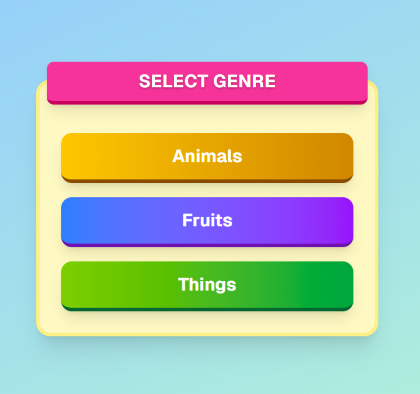
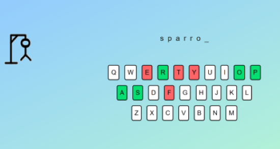
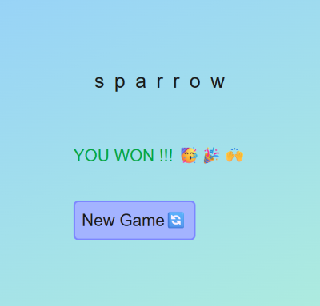
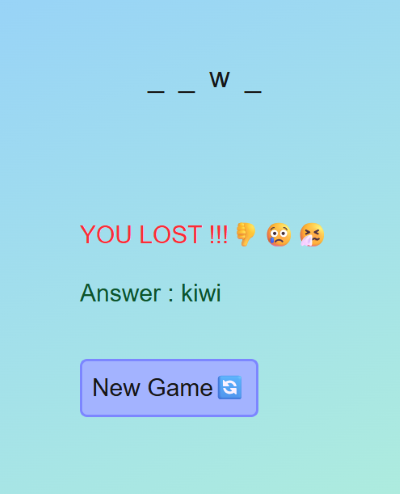

# Hangman Game 

A classic Hangman word-guessing game built with **Next.js**, **Redux**, and **Redux Persist**, with a twist — players can choose from different word genres before playing.
## Features

- 🎮 Interactive Hangman gameplay with on-screen keyboard 
- 📂 Category selection Choose between `Animal`, `Fruit`, or `Thing` before the game begins
- ⚛️ Built using React and Next.js
- 🧠 State managed with Redux Toolkit
- 💾 Persistent game state using Redux Persist
- 🎨 Responsive UI for mobile and desktop
- 💡 Clear visual feedback on win/loss and wrong guesses


## Tech Stack

| Technology     | Description                       |
|----------------|-----------------------------------|
| React          | Frontend UI framework             |
| Next.js        | React framework with SSR/SSG      |
| Redux Toolkit  | Modern state management           |
| Redux Persist  | Store game state in localStorage  |
| Tailwind CSS   | (Optional) For styling (if used)  |

## Installation


**Clone the repository:**

```bash
git clone https://github.com/sophiathapa/Hangman-Game.git

```

**Install dependencies (Lucide React):**

```bash
npm install 
# or
yarn add 
```

**Running the Application**

```bash
npm run dev
# or
yarn dev
```


## Screenshots


###  🏠 Home Page


### 🎮 Game Screen


### 🏆 Won 


### ❌ Lost



